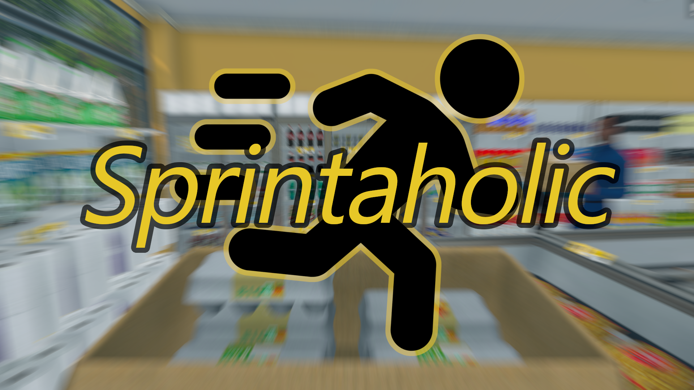

# Sprintaholic 🏃‍➡️

Turn your sprint key into a toggle so you can sprint indefinitely without tiring out your pinkie finger - _**with no configuration required!**_

## Installation

Extremely easy! Just follow these 3 simple steps:

1. If you haven't already, install [Tobey's BepInEx x MelonLoader Pack for Supermarket Simulator](https://github.com/toebeann/BepInEx.SupermarketSimulator) (make sure to read the [Quick Start](https://github.com/toebeann/BepInEx.SupermarketSimulator#quick-start), I promise it's easy!)
2. [Download the latest release of Sprintaholic from the releases page](https://github.com/toebeann/Sprintaholic/releases/latest/download/Tobey.Sprintaholic.SupermarketSimulator.zip)
3. Extract the `BepInEx` folder from the downloaded Sprintaholic zip file into your game folder - an easy way to do this is simply double-click on the zip file and then drag the `BepInEx` folder out into your game folder

That's all there is to it!

## Customisation

If desired, you can also customise your movement speed by editing the config file:

1. Make sure to run the game once with Sprintaholic installed to generate Sprintaholic's config file
2. Find the config file at the location: `Supermarket Simulator` > `BepInEx` > `config` > `Tobey.Sprintaholic.SupermarketSimulator.cfg`
3. Open it in a text editor of your choice such as Notepad, Visual Studio Code, etc.
4. Set the values as desired, making sure to read the comments (the lines beginning with `#`)
5. Reload the game for your changes to take effect

## Need help?

You can use the following channels to ask for help:

-   [Modded Supermarket Simulator Discord](https://discord.gg/hjGpjB3GXA)
-   [Nexus Mods posts tab](https://www.nexusmods.com/supermarketsimulator/mods/792?tab=posts)
-   [GitHub issues](https://github.com/toebeann/Sprintaholic/issues)

## Additional Credits

"sprint" icon by Adrien Coquet from [Noun Project](https://thenounproject.com/browse/icons/term/sprint/) (CC BY 3.0)
